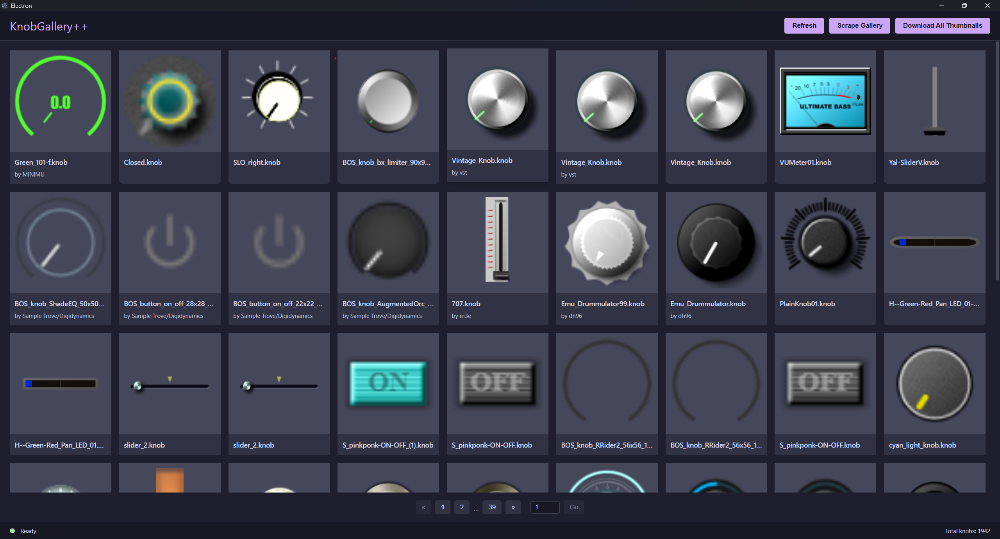

# KnobGallery++

A desktop application for scraping, downloading, and previewing knob assets from the g200kg WebKnobMan gallery.

This project was created with [Ampere](https://github.com/SeamusMullan/ampere).



## Features

- Browse knobs from the g200kg WebKnobMan gallery
- View detailed information about each knob (license, author, date, etc.)
- Download knobs for local use
- Preview knob images
- Track download status and progress

## Roadmap

### Probably Happening

- Implement Search Feature for files
- Allow export to filmstrip for instant use in projects

### Probably Not Happening

- Replace hosting on g200kg with custom implementation (costly)
- Implementing some kind of user file sharing / uploads (same as above)
- Implement custom version of JKnobMan / WebKnobMan (too complex & original source code lost)

## Getting Started

### Prerequisites

- Node.js 16+
- Python 3.11+ (and the uv package manager)
- npm or yarn

### Installation

```bash
# Install dependencies
npm run install:all

# Setup Python environment
cd backend
uv sync
uv pip install -r requirements.txt
```

### Development

```bash
# Start both frontend and backend
# NOTE: this may not work due to unicode rending issues in FastAPI.
# If you face this issues run things seperately
npm run dev

# Or start them separately
npm run dev:frontend
npm run dev:backend
```

## Usage

1. Launch the application using the commands mentioned in the Development section
2. Once the app is running, click "Scrape Gallery" to fetch the latest knobs from the gallery
3. Browse through the knobs in the gallery view
4. Click on a knob to view its details in the preview panel
5. Click "Download Knob File" to save the knob file locally
6. Downloaded knobs will be stored in your home directory under "KnobGallery/knobs"

## Project Structure

```text
├── frontend/        # Electron/Vite + Vue.js frontend
├── backend/         # Python/FastAPI backend
└── package.json     # Root package.json for scripts
```

## License

This project is licensed under the MIT License.

## About the g200kg WebKnobMan Gallery

The g200kg WebKnobMan gallery (<https://www.g200kg.com/en/webknobman/gallery.php>) hosts a collection of knob assets created with the WebKnobMan tool. These knobs are used for creating audio plugin interfaces and other UI elements. Most of them are available under various Creative Commons licenses.

This application allows you to easily browse, preview, and download these assets for use in your own projects, respecting the license terms of each asset.
